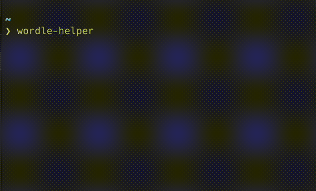

# wordle_solver


solve [Wordle](https://www.powerlanguage.co.uk/wordle/) with CLI.



## Requirement

Rust 1.59 or higher.

So, now (2022.02.05) you have to use nightly version.

```bash
rustup install nightly
```

## Install

```bash
cargo install --git https://github.com/abekoh/wordle_solver
```

## Usage

```
$ wordle-solver
wordle-solver 0.1.0
Solve a wordle question with CLI.

USAGE:
    wordle-solver [OPTIONS]

OPTIONS:
    -d, --dict-path <DICT_PATH>                dictionary path
    -h, --help                                 Print help information
    -m, --max-guess-count <MAX_GUESS_COUNT>    number of answer you can guess [default: 6]
    -V, --version                              Print version information
    -w, --word-length <WORD_LENGTH>            length of one word [default: 5]
```

If you use as default (words of length = 5, number of answer you can guess = 6), it's simple.  
And you can download English words from [dwyl/english-words](https://github.com/dwyl/english-words) automatically.
```bash
wordle-solver
```

You can configure some parameters.

```bash
wordle-solver -d ~/your-original-dict.txt -w 7 -m 10
```
